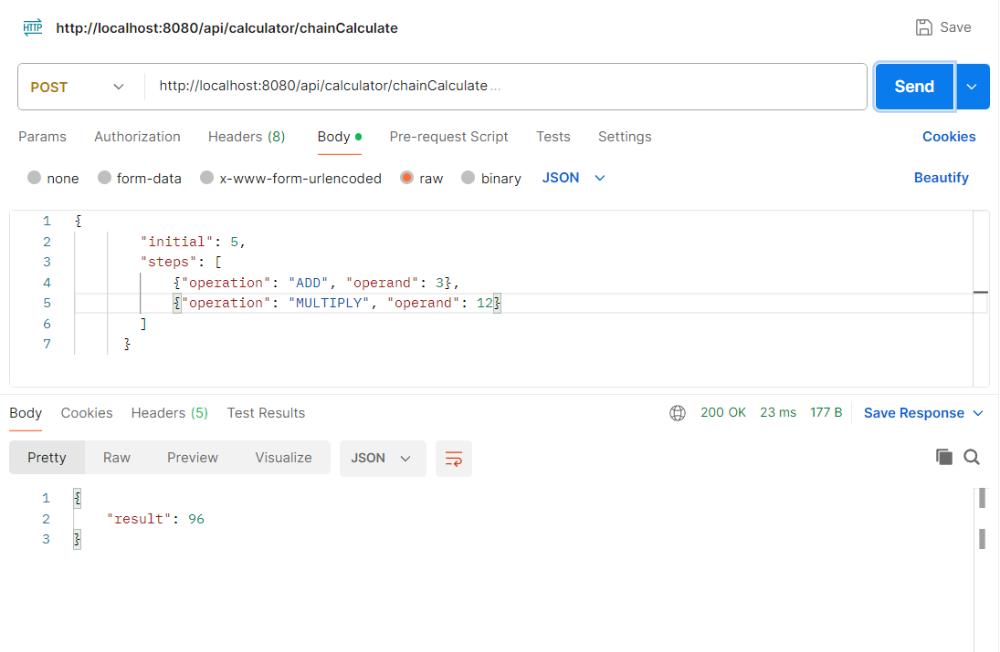

# Project Overview
a SpringBoot application that supports basic arithmetic operations and chained operations.

# Prerequisites
java 11 or later  
Spring 3.0 or later  
Junit  
Maven  
Postman(test)  

# Assumptions & Decisions
1. all arithmetic operations use BigDecimal to avoid issues when working with different num types (int, long, double). results are normalized by stripping trailing zeros.  
2. a global exception handler is implemented using @ControllerAdvice for error handling(unsupported operations, calculation errors, unexpected runtime exception). Error messages will be returned to the client in a JSON format.  
3. tests are organized to cover both normal and edge cases
## Assumptions:
API support only basic arithmetic operations and chained operations.  
client is responsible for sending well-formed JSON to perform operation.   
the application includes error handling for common issues    

# Build and Run
git clone  https://github.com/Jean1615/ebay_assignment.git  
cd flexible-calculator  
mvn clean install  
mvn spring-boot:run  

### to run unit test:
mvn test  

The application will be available at: http://localhost:8080/api/calculator/  
for basic calculation:http://localhost:8080/api/calculator/calculate  
for chain operation: http://localhost:8080/api/calculator/chainCalculate  

# input  example
basic opeartion(json format):  
{
"operation": "ADD",
"num1": 2,
"num2": 3
}  

chain opeartion:  
{
"initial": 5,
"steps": [
{"operation": "ADD", "operand": 3},
{"operation": "MULTIPLY", "operand": 2}
]
}  

### to add a new opeartor
add the enum in Operation class  
create a new implementation in operation package  

